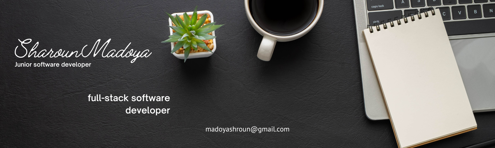

### Hi there 👋

<!--
**Sharoun-Madoya/Sharoun-Madoya** is a ✨ _special_ ✨ repository because its `README.md` (this file) appears on your GitHub profile.

Here are some ideas to get you started:

- 🔭 I’m currently working on ...
- 🌱 I’m currently learning ...
- 👯 I’m looking to collaborate on ...
- 🤔 I’m looking for help with ...
- 💬 Ask me about ...
- 📫 How to reach me: ...
- 😄 Pronouns: ...
- ⚡ Fun fact: ...
-->

“Hello! I just wanted to let you know How much I love front-end developing. I am currently working on JavaScript and React as my framework to create simple easy-to-use beautiful web apps. After majoring in Electrical Instrumentation engineering, I worked for a small start-up as a software developer and soon found myself specializing in front-end software development. I am willing to expand my horizons to projects looking for software support in the Tech industry.”

<table>
  <tr>
    <td align="center">
        <h3>💫 Fun Facts</h3>
        
☕️ <strong>JavaScript</strong> was my the first programming language I learned!

        
🎮 When I'm not coding or creating content, you'll likely find me writing poems. If not, then I maybe<strong>Swimming</strong>.

         
    </td>
    <td align="center">
        <h3>💻 Languages & Tools</h3>
        
    </td>
  </tr>
    <!-- <td colspan="2" align="center"> 
        <h3>🌐 Let's Connect!</h3> 
    </td> -->
  </tr>
</table>